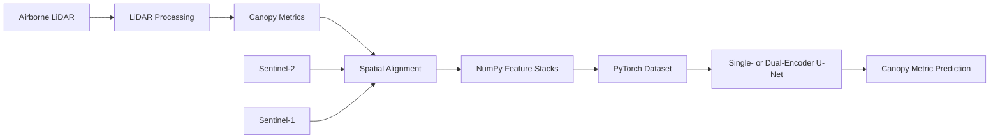

# Multimodal Canopy

A geospatial deep learning pipeline for estimating forest canopy structure from optical imagery, radar, and airborne LiDAR.

## Overview

`multimodal-canopy` combines complementary Earth observation data sources to model fine-scale forest characteristics:

- Sentinel-2 multispectral imagery
- Sentinel-1 C-band SAR
- ALOS PALSAR L-band SAR
- British Columbia airborne LiDAR

The project transforms heterogeneous geospatial data into spatially aligned feature stacks, then trains convolutional neural networks to predict LiDAR-derived canopy metrics.

The primary modeling task is dense, pixel-level canopy height estimation using custome U-Net architectures.

## Pipeline



## Key Features

- Downloads and preprocesses satellite imagery through Google Earth Engine
- Computes canopy height and structural metrics from LiDAR point clouds
- Reprojects and aligns raster layers to a common spatial grid
- Handles missing feature data through interpolation and nodata masking
- Produces compact `128 x 128` training tiles
- Supports optical-only, SAR-only, and multimodal neural networks
- Uses masked MSE, MAE, and mean error metrics for incomplete LiDAR targets

## Data Sources

| Source | Role | Resolution |
| --- | --- | --- |
| Sentinel-2 SR Harmonized | Multispectral optical features | 10 m and 20 m |
| Sentinel-1 GRD | C-band VV and VH SAR features | 10 m |
| ALOS PALSAR | L-band HH and HV SAR features | Resampled to 10 m |
| BC airborne LiDAR point cloud and derived products | Training targets and canopy structure metrics | Derived products aggregated to 10 m |

Sentinel-2 imagery is cloud- and snow-masked, composited over a configurable date range, and converted to scaled reflectance. SAR imagery is composited over a specififed date range.

## Feature Stack

The default feature stack contains 11 input channels:

1. Sentinel-2 B2
2. Sentinel-2 B3
3. Sentinel-2 B4
4. Sentinel-2 B5
5. Sentinel-2 B6
6. Sentinel-2 B7
7. Sentinel-2 B8
8. Sentinel-2 B11
9. Sentinel-2 B12
10. Sentinel-1 VV
11. Sentinel-1 VH

The target channel is typically a LiDAR-derived canopy metric such as canopy height.

Each binary training sample is stored as a NumPy array with shape:

```text
(channel, height, width)
```

Invalid target pixels are returned with a corresponding validity mask so they do not contribute to the loss.

## Repository Structure

```text
.
├── data/
│   ├── binary_stacks/       Training-ready NumPy arrays
│   ├── canopy_metrics/      LiDAR-derived canopy metrics
│   ├── lidar_to_process/    Raw or unprocessed LiDAR inputs
│   ├── lidar_processed/     Processed LiDAR outputs
│   ├── lidar_bc_dems/       Digital elevation and canopy models
│   ├── gee/                 Downloaded satellite feature rasters
│   └── figs/                Generated visualizations
├── models/
│   ├── `dataset.py`           PyTorch dataset implementation
│   ├── `u_nets.py`            Single- and dual-encoder U-Net models
│   ├── graphs/              Model diagrams and architecture outputs
│   └── weights/             Saved model checkpoints
├── notebooks/
|   ├── 01_fetch_dems.ipynb
│   ├── 01_data_ingestion.ipynb
│   ├── 02_process_lidar.ipynb
│   └── `03_model.ipynb`       Training and ablation experiments
├── scripts/
│   ├── `compute_chms.py`      Creates canopy height models from DSM and DTM rasters
│   ├── `process_lidar.py`     Converts LiDAR point clouds into canopy metrics
│   ├── `preprocess.py`        Aligns, fills, and writes training stacks
│   └── `gee_fetch.py`         Retrieves Sentinel-1 and Sentinel-2 features
├── `environment.yml`          Conda environment specification
└── `map.qgz`                 QGIS visualization project
```

## Processing Modules

### LiDAR Processing

`scripts/process_lidar.py` uses PDAL, `laspy`, and `pyforestscan` to:

- Remove noise classifications
- Calculate height above ground
- Voxelize point clouds
- Estimate canopy height
- Calculate rugosity
- Calculate plant area index
- Estimate canopy cover
- Aggregate outputs to a 10 m grid

### Canopy Height Models

`scripts/compute_chms.py` creates canopy height models by subtracting aligned digital terrain models from digital surface models. Outputs are clipped to non-negative heights and reduced to a 10 m grid.

### Satellite Ingestion

`scripts/gee_fetch.py` retrieves satellite imagery using Google Earth Engine and `geemap`.

The script:

- Derives each region of interest from a LiDAR raster
- Uses the LiDAR acquisition date to define the imagery window
- Creates cloud-filtered Sentinel-2 median composites
- Resamples 20 m Sentinel-2 bands to the 10 m grid
- Creates Sentinel-1 VV/VH median composites
- Writes aligned GeoTIFF feature stacks

### Raster Preprocessing

`scripts/preprocess.py` matches satellite rasters to LiDAR-derived target rasters, crops them to a common spatial window, fills missing feature pixels, and writes `.npy` training samples.

Feature gaps are filled using linear spatial interpolation with nearest-neighbor fallback at image boundaries. Target channels remain un-interpolated.

## Model Architecture

The project includes two custome PyTorch models:

### `SingleEncoderUNet`

A standard U-Net that accepts one feature group, such as:

- Optical features only
- SAR features only

### `DualEncoderUNet`

A multimodal U-Net with separate encoders for:

- Optical imagery
- SAR imagery

The encoded representations are fused at the bottleneck and passed through a shared decoder. This design allows each sensor family to learn independent low-level representations before multimodal feature fusion.


## Installation

Create the Conda environment:

```bash
conda env create -f environment.yml
conda activate multimodal_canopy
```

The environment includes geospatial, scientific Python, Earth Engine, and PyTorch dependencies.

## Google Earth Engine Setup

Authenticate with Earth Engine before running the ingestion workflow:

```python
import ee

ee.Authenticate()
ee.Initialize(project="YOUR_GEE_PROJECT_ID")
```

Update the project ID and input/output paths for your environment. The notebook workflow in `01_data_ingestion.ipynb` provides an interactive starting point.

## Example Commands

Process LiDAR point clouds:

```bash
python scripts/process_lidar.py \
    data/lidar_to_process \
    data/canopy_metrics
```

Compute canopy height models:

```bash
python scripts/compute_chms.py \
    data/lidar_bc_dems/dsm \
    data/lidar_bc_dems/dtm \
    data/lidar_bc_dems/chm
```

Build aligned NumPy training stacks:

```bash
python scripts/preprocess.py \
    data/canopy_metrics \
    data/gee \
    data/binary_stacks
```

Satellite data ingestion is currently primarily performed using `gee_fetch.py`.

## Training Workflow

The modeling notebook:

1. Loads binary feature stacks with `CanopyDataset`
2. Splits the data into training, validation, and test subsets
3. Separates optical and SAR channels
4. Trains single- or dual-encoder U-Net models
5. Computes masked pixel-level errors
6. Saves model checkpoints and diagnostic plots
7. Compares the contribution of optical and SAR inputs

The default experiment uses a deterministic random seed and a `70% / 20% / 10%` train-validation-test split.
